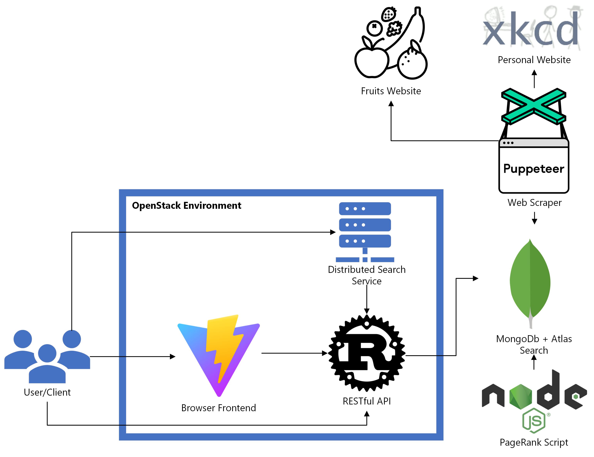

# Assignment 1 COMP 4601 F2023

## Author

Andrew Guo

## Video Demo

[https://www.youtube.com/playlist?list=PLqsus4thrYU4KnGjcVnL8opoPRU2yZITJ](https://www.youtube.com/playlist?list=PLqsus4thrYU4KnGjcVnL8opoPRU2yZITJ)

## Description

A full stack search engine web app featuring a RESTful API layer and search-as-you-type browser frontend. Deployed on OpenStack and connected to the distributed search service.

## Visit Website at

- 134.117.132.128:4000

## Summary of Features

- Stored crawled data in database. ✅
- Stored PageRank calculations in database. ✅
- Support RESTful queries on the following endpoints:
  - /fruits ✅
  - /personal ✅
- Support the following query parameters on the endpoints:
  - q: string ✅
  - boost: boolean ✅
  - limit: integer ✅
- Browser-based interface allows for user to specify:
  - Text for their search ✅
  - Whether to boost the PageRank boost ✅
  - The number of results ✅
- Search results display:
  - The URL to the original page ✅
  - The title of the original page ✅
  - The PageRank of the page/search score for the page ✅
  - A link to a more detailed view that displays:
    - URL ✅
    - Title ✅
    - List of incoming links ✅
    - List of outgoing links ✅
    - Keyword frequency ✅
- If search requests JSON the data sent contains:
  - name ✅
  - url ✅
  - score ✅
  - title ✅
  - pr ✅

## Discussion Response

1. **How does your crawler work? What information does it extract from the page? How does it store the data? Is there any intermediary processing you perform to facilitate the later steps of the assignment?**
   1. The crawler will use a Breadth First Search algorithm to visit every page. The crawler will store every link on the page according to its selection policy described below. In addition, the relevant content of the page will be stored as well (e.g. text, title, images, etc.). For intermediary processing, the crawler will store a list of keywords that can later be used for term frequency calculations.
2. **Discuss the RESTful design of your server. How has your implementation incorporated the various REST principles?**
   1. Each endpoint and method will return appropriate HTTP response codes based on the result of the client's request. For example, a client who successfully requests a search will receive a GET 200 OK, a client who requests an id that does not exist will receive a 404 not found, a client requesting an HTTP representation will receive a 308 permanent redirect. In addition to sending each resource, the api layer will send related URI's in accordance with the HATEOAS constraint of REST application architecture.
3. **Explain how the content score for the search is generated.**
   1. The search engine integrates MongoDb Atlas' index and search features. This allows for a powerful full-text search powered by Apache Lucene. The scoring method is built upon TF-IDF by the BM25 ranking function that is this function `(boost * idf * tf)` in addition to a distance decay function `(pivot / (pivot + abs(fieldValue - origin)))`. For more in-depth scoring details, each individual page result features additional info that can accessed by the user in the browser.
4. **Discuss the PageRank calculation and how you have implemented it.**
   1. Using techniques from Lab 5, the PageRank calculation is implemented using power iteration. The results were calculated using an alpha value of 0.1 and halted after the Euclidean distance between the PageRank vectors were less than 0.0001.
5. **How have you defined your page selection policy for your crawler for your personal site?**
   1. The crawler will explore all hrefs on each `/fruits` page it visits, assuming it has not visited this link before. This is fine for our lab as every link is within the same domain we are interested in (i.e. /~davidmckenney/fruitgraph/). For the `/personal` page, the crawler will visit every href it has not previously visited inside the main content box except for the `/random/comic/` route of the website.
6. **Why did you select the personal site you chose? Did you run into any problems when working with this site? How did you address these problems?**
   1. I decided to scrape the Xkcd web comics site since it met the required number of pages, had static content, and I thought it would be friendly to web scraping. My main concern was to not lower my ip reputation and/or get ip banned. Though, I made sure to proxy from Carleton's ip just in case [😁](https://emojipedia.org/beaming-face-with-smiling-eyes). The only issue with the site I chose is that I had to design my selection policy to not visit the `/random/comic/` as these would lead to non-deterministic results in my PageRank calculations.
7. **Critique your search engine. How well does it work? How well will it scale? How do you think it could be improved?**
   1. I believe my current design will scale if given the appropriate hardware.
   2. The frontend is simply a Single Page Application that can be easily served in a ~400 kb bundle, in production, this can be easily distributed to the edge servers of any CDN provider.
   3. The backend is a MongoDb Atlas service that is designed for enterprise usage in production. However, the current backend is hosted on a shared cluster with limited Storage and shared RAM + vCores which will likely be a bottleneck at scale.
   4. The API layer is created using axum in Rust which, unlike Nodejs, implements an asynchronous application with multi-threading thanks to the Tokio runtime. Axum currently ranks in the [Top 10 fastest web frameworks](https://www.techempower.com/benchmarks/#section=data-r21&test=composite) and is much faster and stable than Express.js. Similarly to the backend, the current API is hosted on shared computing resources in OpenStack which will likely be a bottleneck at scale.
   5. My search engine can be improved by adding pagination and indexing more meta data (i.e. also scrape Xkcd explained).
